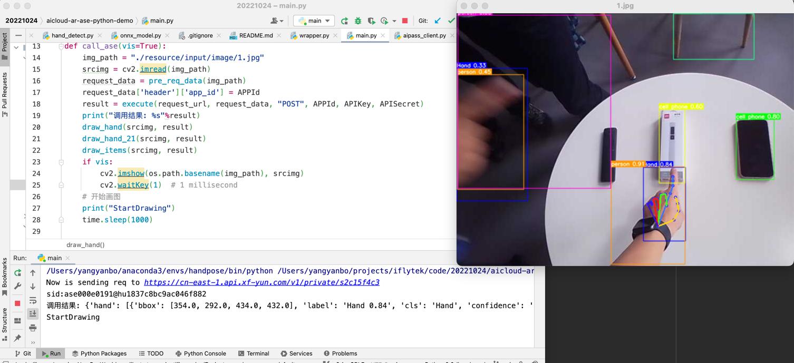

# AI Service Engine

<!-- markdownlint-disable MD033 -->

<span class="badge-placeholder">[](https://img.shields.io/github/forks/xfyun/aiges)</span>
<span class="badge-placeholder">[](https://img.shields.io/github/stars/xfyun/aiges)</span>
<span class="badge-placeholder">[](https://github.com/xfyun/aiges/actions/workflows/build.yaml)</span>
<span class="badge-placeholder">[](https://github.com/xfyun/aiges/releases/latest)</span>
<span class="badge-placeholder">[](https://github.com/xfyun/AthenaServing/graphs/contributors)</span>
<span class="badge-placeholder">[](https://github.com/iflytek/aiges/blob/master/LICENSE)</span>


<!-- markdownlint-restore -->

## 官方文档

[👉👉👉点击进入](https://iflytek.github.io/athena_website/)

## 背景

> AIGES是 Athena Serving Framework中的核心组件,它是一个个专为AI能力开发者打造的AI算法模型、引擎的通用封装工具。
> 您可以通过集成AIGES,快速部署AI算法模型、引擎，并托管于Athena Serving Framework，即可使用网络、分发策略、数据处理等配套辅助系统。
> Athena Serving Framework 致力于加速AI算法模型、引擎云服务化，并借助云原生架构，为云服务的稳定提供多重保障。
> 您无需关注底层基础设施及服务化相关的开发、治理和运维，即可高效、安全对模型、引擎进行部署、升级、扩缩、运营和监控。

## 整体架构


## 使用工作流(AthenaServing)


#### 特性

&#9745; 支持模型推理成RPC服务(Serving框架会转成HTTP服务)

&#9745; 支持C代码推理

&#9745; 支持Python代码推理

&#9745; 支持once(非流式)推理、流式推理

&#9745; 支持配置中心，服务发现

&#9745; 支持负载均衡配置

&#9745; 支持HTTP/GRPC服务

#### SDK

[👉👉👉Python](https://github.com/xfyun/aiges_python)

#### AI协议

参见: [👉👉👉ase-proto](https://github.com/xfyun/ase_protocol)

### 开源版docker镜像

#### 基础镜像

**基础镜像中提供**

- 基础的编译好的 Python加载器AIService(包含支持python的libwrapper.so), 目录结构如下

  AIGES的二进制文件未AIservice, 默认放置于 容器`/home/aiges`目录
    ```bash
    root@e38a9aacc355:/home/aiges# pwd
    /home/aiges
    root@e38a9aacc355:/home/aiges# ls -l /home/aiges/
    total 18760
    -rwxr-xr-x 1 root root 19181688 Jun 10 15:30 AIservice
    -rw-r--r-- 1 root root     2004 Jun 10 18:15 aiges.toml
    drwxr-xr-x 3 root root     4096 Jun 10 15:30 include
    drwxrwxrwx 1 root root     4096 Jun 10 15:31 library
    drwxr--r-- 2 root root     4096 Jun 10 18:16 log
    -rw-r--r-- 1 root root       96 Jun 10 18:15 start_test.sh
    drwxr-xr-x 2 root root     4096 Jun 10 18:16 xsf_status
    drwxr-xr-x 2 root root     17711057 Jun 10 18:16 xtest
    -rw-r--r-- 1 root root     4232 Jun 10 17:54 xtest.toml
    ```
  其中`aiges.toml`用于本地启动测试使用

- Python环境: 不推荐用户后续镜像构建修改Python版本

#### 业务镜像

**业务镜像一般需要用户自己编写Dockerfile构建，业务镜像中用户可以根据场景需要定制安装**

- 推理运行时，如`onnxruntime`、`torchvision`等

- gpu驱动，`cuda`，`cudnn`等驱动

示例Dockerfile地址为

* [YOLOV5](/demo/yolov5/Dockerfile)

* [调用三方API](/demo/music_api/Dockerfile_v1)

#### 基础镜像构建(GPU)

***基础镜像仅在特殊需求时(如对cuda，python版本有要求时才需要重新构建,一般用户仅需关注构建业务镜像)***

1. cuda-go-python基础镜像,用于编译aiges项目的基础镜像，参见[官方仓库](https://github.com/iflytek/aiges/releases)
   ，本仓库引用了部分版本，存放于 [docker/gpu/cuda](docker/gpu/cuda)中
   基础镜像当前基于 nvidia/cuda 官方的基础镜像作为base镜像 如 [cuda-10.1](docker/gpu/base/cuda-10.1)中所示: aiges基础镜像基于 ***形如 nvidia/cuda:
   10.1-devel-ubuntu18.04*** 构建

2. 基于 [cuda-10.1](docker/gpu/base/cuda-10.1) 已构建出**public.ecr.aws/iflytek-open/aiges-gpu:
   10.1-1.17-3.9.13-ubuntu1804-v2.0.0-rc6**

3. aiges: 基于 [aiges-dockerifle](docker/gpu/aiges/ubuntu1804)目录中不同CUDA版本的Dockerfile构建`aiges`基础镜像

构建命令:

```bash
docker buildx build -f docker/gpu/base/cuda-10.2/Dockerfile -t artifacts.iflytek.com/docker-private/atp/cuda-go-python-base:10.2-1.17-3.9.13-ubuntu1804  . --push
```

**当前支持的[cuda-go-python基础镜像列表(包含cuda-go-python编译环境)](https://github.com/iflytek/aiges/releases)**

***当前支持的[aiges基础镜像列表](https://github.com/iflytek/aiges/releases)***

***构建命令***:

1. 使用buildx:
   ```bash
   docker buildx build  -f docker/gpu/aiges/ubuntu1804/Dockerfile . -t artifacts.iflytek.com/docker-private/atp/aiges-gpu:10.1-3.9.13-ubuntu1804
   ```

2. 使用docker build
   ```bash
   docker buildx build  -f docker/gpu/aiges/ubuntu1804/Dockerfile . -t artifacts.iflytek.com/docker-private/atp/aiges-gpu:10.1-3.9.13-ubuntu1804
   ```

3. 使用buildah
   ```bash
   buildah build  -f docker/gpu/aiges/ubuntu1804/Dockerfile . -t artifacts.iflytek.com/docker-private/atp/aiges-gpu:10.1-3.9.13-ubuntu1804
   ```

#### 业务镜像构建方法

业务镜像需要基于 aiges基础镜像进行构建，用户可在此过程定制 python的依赖项目以及用户自研项目

参考示例:

* [YOLOV5](demo/yolo5/Dockerfile)

* [handpose3in1](https://github.com/berlinsaint/handpose3in1)

#### 快速创建Python推理项目

* 示例已经提供gpu runtime安装方法
* **Python加载器插件V2**
    - 本地安装或者更新`aiges`
       ```shell
       # 安装aiges
       pip install aiges -i https://pypi.python.org/simple
       # 更新aiges
       pip install --upgrade aiges -i https://pypi.python.org/simple
       ```
    - 快速开始一个Python加载器插件项目
       ```python
       python -m aiges create -n  "project" 
        ```
      该指令生成一个 "project" 文件夹，并包含`wrapper.py`的半成品
    - 添加项目内依赖，完善`wrapper.py`的编写，完成本地调试
        * 实现`Wrapper`类时，必须**继承**`WrapperBase`类
        * 运行中用到的参数，将变量声明为类变量。为了模拟AIservice传递参数，在`Wrapper`类中声明一个类成员config用于初始化

        * `wrapperOnceExec`函数执行返回的类型是`Response`对象，而不是通常表示执行状态错误码的`int`类型，意味着**无论结果正常与否**，均需实例化`Response`对象并返回
           ```python
           res = Response()
           ```
            1. 未出现异常时，`Response`对象是是由一个或多个`ResponseData`对象构成的列表
               ```python
               l = ResponseData()
               l.key = "output_text"
               l.status = aiges.dto.Once
               l.len = len(r.text.encode())
               l.data = r.text
               l.type = aiges.dto.TextData
               res.list = [l]
               # multi data: res.list = [l1, l2, l3]
               return res
               ```
            2. 出现异常时，直接调用`Response`对象的`response_err`方法返回错误码
               ```python
               return res.response_err(ERROR_CODE)
               ```
    - 额外声明**用户请求**和**用户响应**两个类
      **用户请求类**的`StringParamField`、`NumberParamField`、`BooleanParamField`和`IntegerParamField`类型模拟了`wrapperOnceExec`
      中的`params`参数，通过`key`获取`value`

      **用户请求类**的`ImageBodyField`、`StringBodyField`和`AudioBodyField`字段模拟了`wrapperOnceExec`中的`reqdata`
      参数，通过`reqData.get(key)`方式获取到这个 body 的结构
         ```python
         class UserRequest(object):
            '''
            定义请求类:
            params:  params 开头的属性代表最终HTTP协议中的功能参数parameters部分， 对应的是   xtest.toml中的parameter字段
                     params Field支持 StringParamField，
                     NumberParamField，BooleanParamField,IntegerParamField，每个字段均支持枚举
                     params 属性多用于协议中的控制字段，请求body字段不属于params范畴

            input:    input字段多用与请求数据段，即body部分，当前支持 ImageBodyField、 StringBodyField和AudioBodyField
            '''
            params1 = StringParamField(key="mode", enums=["music", "humming"], value='humming')

            input1 = AudioBodyField(key="data", path="/home/wrapper/test.wav")
            
         class UserResponse(object):
            '''
            定义响应类:
            accepts:  accepts代表响应中包含哪些字段, 以及数据类型

            input:    input字段多用与请求数据段，即body部分，当前支持 ImageBodyField, StringBodyField, 和AudioBodyField
            '''
            accept1 = StringBodyField(key="ouput_text")
         ```
    - 实例化用户请求和用户响应对象
       ```python
       class Wrapper(WrapperBase):
          # 实例化用户请求类和用户响应类
          requestCls = UserRequest()
          responseCls = UserResponse()
          ......
       ```

    - 声明`main`函数，实例化`Wrapper`对象，运行程序
       ```python
       if __name__ == '__main__':
          m = Wrapper()
          m.schema()
          m.run()
       ```

    - 理论上用户除了上传 wrapper.py 以及相关依赖之外，还需要提供一些模型文件，这些文件比较大，一般不在Dockerfile中构建入镜像，会导致git代码库十分庞大,当前示例的的yolov5和 mmocr均在 wrapper
      init的时候下载模型

#### 服务部署

[👉👉👉点击进入](https://iflytek.github.io/athena_website/docs/%E5%8A%A0%E8%BD%BD%E5%99%A8/%E5%88%9B%E5%BB%BAwrapper/%E6%9C%8D%E5%8A%A1%E9%83%A8%E7%BD%B2)

#### 服务化调用示例

* Once推理示例:


***调用代码，近期开放，敬请期待***

* 流式推理demo


## 联系我们

* focus on:

[](https://github.com/iflytek)

* contact:


**注意备注来源: 开源** 


